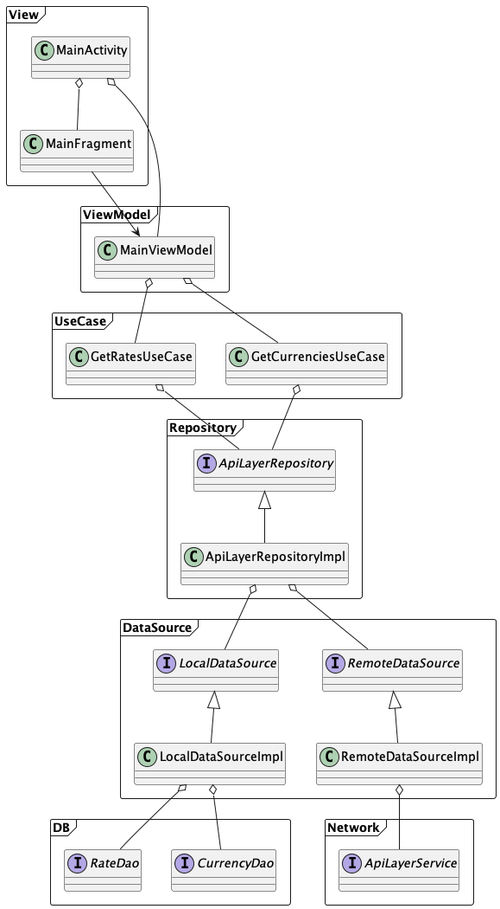

## About this project
- 100% kotlin
- Jetpack
- Android Architecture Components
  - ViewModel
  - LiveData
- Manual dependency injection
- DB
  - Room
- Network
  - Retrofit
- Mock
  - Mockk

## Project structure
- Use MVVM and clean architecture to build for
  - Separation of Concerns
    - UI logic resides in the View and ViewModel, while the business logic and data access are handled by Repository & Use Case. This separation makes the codebase more maintainable, testable, and easier to understand.
  - Testability
    - Easily tested by mocking dependencies and verifying its behavior.
  - Reusability
    - This modular approach allows for easier code reuse, as different components can be plugged into multiple projects without tightly coupling them to the specific implementation.
  - Scalability
    - The separation of layers and dependencies allows for easier addition or modification of features without affecting the entire codebase.

  

## How to build
- Use `./gradlew installDebug` to install App to connected device/emulator
- Use `./gradlew assembleDebug` to build debug apk file

## Test
### Unit test
Use `./gradlew test` to run unit tests, due to the time limitation, only focus on core business rules in following packages
- repository
  - ApiLayerRepositoryTest
- usecase
  - GetCurrenciesUseCaseTest
  - GetRatesUseCaseTest
- viewmodel
  - MainViewModelTest

### Instrumented test
Use `./gradlew connectedAndroidTest` to run unit tests, due to the time limitation, only test Room's write and read
- CurrencyDaoTest
- RateDaoTest

## TODOs
- Unit test for data source classes
- More instrumental tests
- Use DI tools, e.g., Hilt
